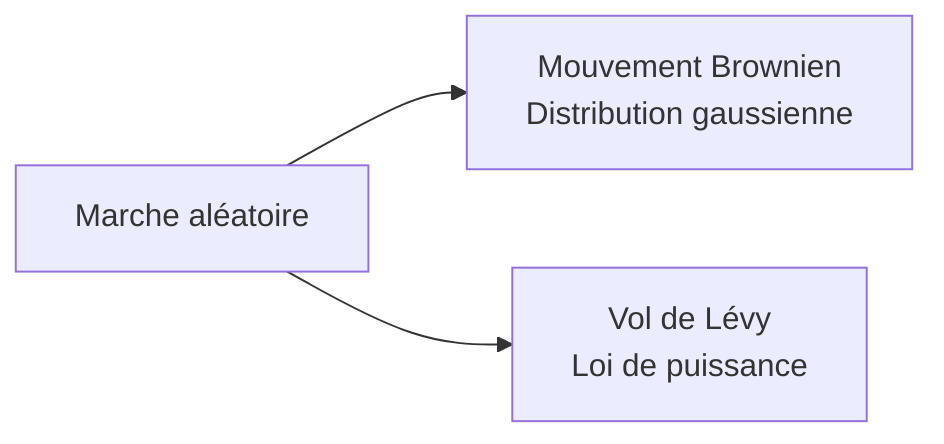

# Optimisation par essaim de particules (PSO), algorithme des lucioles et recherche du coucou

## Introduction

L'**Optimisation par essaim de particules** (Particle Swarm Optimization, PSO) a été initialement introduite par Eberhart et Kennedy en 1995.

Cette approche d'optimisation est adaptée aux problèmes d'optimisation continue (par exemple, $S \subset \mathbb{R}^n$, borné). Un essaim de particules explore l'espace de recherche à la recherche de l'optimum global.

***

### Principes fondateurs du PSO

**Intelligence en essaim** :

Le PSO s'inspire du comportement collectif d'animaux sociaux (par exemple, les vols d'oiseaux, les bancs de poissons, les insectes), où des agents simples se coordonnent pour réaliser un comportement de groupe complexe.

C'est une métaheuristique **basée sur une population** (comme AS et ACS).

Elle cherche un équilibre entre deux comportements concurrents :

- D'une part, les "animaux" suivent le meilleur individu du groupe : celui qui connaît un chemin vers l'optimum (source de nourriture).
- D'autre part, les "animaux" suivent leur "instinct" et adaptent leur mouvement en fonction de leur propre connaissance du point optimal.

***

## Algorithme PSO

Nous partons d'une population de $N$ particules (ou agents).

D'un point de vue mécanique :

- Notons $\mathbf{x}_i(t) \in S$ la position de la particule $i$ à l'itération $t$.
- Chaque $\mathbf{x}_i$ est une solution possible avec une fitness $f(x_i)$.
- L'espace de recherche $S$ est l'espace physique de déplacement des particules.
- D'une itération à la suivante, les particules se déplacent dans l'espace de recherche selon une vitesse donnée $\mathbf{v}_i$.

***

### Meilleur local (Particle-best)

Première tendance : Expérience personnelle → Attraction vers le meilleur local :

À chaque itération $t$, nous mettons à jour le **meilleur local** (particle-best) $\mathbf{x}_i^{\mathrm{best}}(t)$. Cette valeur correspond à la meilleure fitness visitée par la particule/individu $i$ depuis le début du processus de recherche.

$$
x_{i}^{\mathrm{best}}(t) = \left\{ \begin{array}{cc}x_{i}(t) & \mathrm{si~}f(x_{i})\mathrm{~meilleure~que~}f(x_{i}^{\mathrm{best}})\\ x_{i}^{\mathrm{best}}(t - 1) & \mathrm{sinon} \end{array} \right.
$$

***

### Meilleur global (Global-best)

Deuxième tendance : **Expérience sociale** → Attraction vers le **meilleur global** :

- Nous considérons également le **meilleur global** $B(t)$, également mis à jour à chaque itération.
- Cette valeur correspond à la meilleure fitness globale trouvée jusqu'à l'itération $t$ par l'ensemble de la population de particules.

$$
B(t) = \arg\max_{\mathbf{x}_i^{\text{best}}(t)} f(\mathbf{x}_i^{\text{best}}(t))
$$

- Pourquoi un **comportement social** ? À cause du **partage d'information** :
  - Les particules partagent des informations *indirectement* en diffusant leurs meilleures solutions trouvées.
  - Cela permet à l'essaim de converger vers des régions prometteuses.

***

### Troisième tendance : Inertie

Les trois forces agissant sur une particule PSO sont :
1. L'inertie de son mouvement précédent.
2. L'attraction vers sa meilleure position personnelle (meilleur local).
3. L'attraction vers la meilleure position globale de l'essaim.

***

### Règles de mouvement des particules

Les règles de mise à jour pour le mouvement des particules sont :

$$
\begin{aligned}
\mathbf{v}_i(t+1) &= \omega \mathbf{v}_i(t) + c_1 r_1(t+1)[\mathbf{x}_i^{\text{best}}(t) - \mathbf{x}_i(t)] \\
&\quad + c_2 r_2(t+1)[\mathbf{B}(t) - \mathbf{x}_i(t)] \\
\mathbf{x}_i(t+1) &= \mathbf{x}_i(t) + \mathbf{v}_i(t+1)
\end{aligned}
$$

Notes :

- Ces équations sont des **équations vectorielles** (chaque composante est mise à jour en 2D ou 3D).
- **Initialisation aléatoire** : les particules sont typiquement uniformément réparties dans l'espace de recherche $S$ avec une vitesse initiale nulle.

***

#### Paramètres de l'algorithme

- $\omega$, $c_{1}$ et $c_{2}$ sont des paramètres constants à spécifier.
- $r_{1}$ et $r_{2}$ sont des nombres aléatoires uniformément tirés de l'intervalle $[0,1[$ → introduisent la stochasticité. En général, des nombres aléatoires différents sont tirés pour chaque composante directionnelle de la vitesse.

***

#### Interprétation et sélection des paramètres de guidage

- Le paramètre $c_1$ est le **coefficient cognitif**, intégrant la perception individuelle de chaque particule par rapport à la position optimale.
- Le paramètre $c_2$ est le **coefficient social**, intégrant l'évaluation collective (groupe) de la recherche de l'optimum.
- Classiquement, $c_1 \approx c_2 \approx 2$.
- $\omega$ se réfère à l'inertie au changement et est typiquement choisi légèrement inférieur à 1.

***

#### Contrôle des vitesses et positions

Il est courant d'imposer des limites à la valeur absolue de chaque composante de la vitesse $\mathbf{v}_i$ pour éviter qu'elles ne deviennent trop grandes.

Une valeur de coupure $\mathbf{v}_{\mathrm{max}}$ est prescrite.

De même, une limite $\mathbf{x}_{\mathrm{max}}$ est imposée à chaque position $\mathbf{x}_i$ pour s'assurer que la particule reste dans les limites du domaine.

Il est nécessaire de travailler dans un espace de recherche où les opérations arithmétiques de somme et de produit ont un sens. Que faire si les variables du problème sont booléennes ? Le PSO peut-il traiter des problèmes combinatoires ?

***

### Remarques générales

Comme l'Ant System (AS) :

- Le PSO est une métaheuristique basée sur une population : à chaque itération, $N$ solutions candidates sont générées et cet ensemble de solutions est utilisé pour construire la génération suivante.
- Le PSO admet de nombreuses variantes bâties sur le squelette de cet algorithme.
- Dans certaines variantes, la position du meilleur global $B(t)$ peut être définie/restreinte à une sous-population dans un voisinage donné de l'agent $i$. Cela reviendrait à avoir le voisinage social intégré dans l'espace. Dans ce cas, $B = B_i$ varie d'un agent à l'autre.

**Convergence** : Le PSO est caractérisé par une vitesse de convergence rapide.

**Implémentation** : Des implémentations simples !

**Équilibre entre exploration et exploitation** :

- Le caractère aléatoire et l'inertie dans les mises à jour de vitesse équilibrent l'exploration (recherche de nouvelles régions) et l'exploitation (affinement des bonnes régions connues).

***

## Exemples

### Exemple #1 : Problème jouet 1D

Intuition sur le fonctionnement interne du PSO :

Considérons un problème jouet avec un paysage de fitness assez régulier dans un espace de recherche unidimensionnel (1D) $S = [a,b] \in \mathbf{R}$. Nous considérons une petite population de particules : $N = 2$ particules ! Cela nous permet d'analyser comment elles interagissent socialement pour s'approcher mutuellement de l'optimum (ici un maximum).

Paramètres : $\omega = 0.9$, $S = [- 1, 8]$, positions initiales aléatoires, vitesse initiale nulle.

- Initialement, les deux particules ont une vitesse nulle.
- Leur meilleur local $b_i(t = 0)$ est leur position actuelle.
- Le meilleur global $B(t = 0)$ est la position de la particule la plus proche du maximum (ici la noire).

Ensuite, nous résolvons le système suivant pour $i = 1, 2$ :

$$
\begin{aligned}
v_i(t + 1) &= 0.9v_i(t) + [b_i(t) - x_i(t)] + [B(t) - x_i(t)] \\
x_i(t + 1) &= x_i(t) + 0.2v_i(t + 1)
\end{aligned}
$$

Ici : $c_1 = c_2 = 1$.

***

#### Dynamique observée

- La particule grise est attirée par la noire, tandis que cette dernière ne bouge pas puisqu'elle est déjà à la position du meilleur global.
- Comme la particule grise augmente sa fitness, son meilleur local reste sa position courante, ce qui ne modifie pas son attraction vers la particule noire.
- En raison de son élan, la particule grise dépasse la noire et atteint une valeur de fitness plus élevée.
- Elle devient le nouveau meilleur global et s'arrête progressivement.
- D'autre part, la particule noire est maintenant mise en mouvement par le nouveau statut de la particule grise.
- Et ce processus continue au fur et à mesure des itérations.

Note : Nous montrons les particules se déplaçant sur la courbe de fitness à des fins d'illustration ! Elles se déplacent le long de l'axe $x$.

***

### Exemple #2 : Recherche 2D avec un optimum unique

Un cas "légèrement" plus réaliste :

Nous rendons progressivement le problème d'optimisation plus difficile. Nous considérons maintenant un espace de recherche bidimensionnel $[0,80] \times [0,60] \subset \mathbb{R}^{2}$ avec un seul optimum.

Nous discrétisons l'espace de recherche pour travailler dans $\mathbb{Z}^2$.

Nous répartissons aléatoirement $N = 5$ particules dans $S$ avec une vitesse initiale nulle.

Optimum global : position (75, 36) et fitness 0.436.

Recherche exhaustive : $80 \times 60 = 4'800$ évaluations (en supposant des positions limitées à $\mathbb{Z}^2$).

Avec 5 particules et 50 itérations, la meilleure solution trouvée en un seul run (correspondant à la figure précédente) est :

$$ \mathbf{B} = (75,39) \qquad f(\mathbf{B}) = 0.384 $$

Avec 20 particules et 100 itérations, l'optimum global est trouvé à chaque exécution. On remarque le regroupement des particules autour du maximum. Ici, $r_1 = r_2 = 1$, et les particules rebondissent sur les bords du domaine.

***

### Exemple #3 : Recherche 2D avec une fitness multimodale

Nous continuons à complexifier le problème d'optimisation. Même espace de recherche 2D $S = [0,80] \times [0,60]$ mais maintenant avec une fonction de fitness multimodale.

Nous considérons 10 particules sur 200 itérations.

Cela correspond à un effort de calcul de $10 \times 200 = 2000$ évaluations, inférieur à ce qui est requis pour une recherche exhaustive, avec $60 \times 80 = 4800$ points à explorer.

Optimum global : position (22, 7) et fitness correspondante 0.754.

Avec 10 particules sur 200 itérations, la meilleure solution identifiée en 1 run est :

$$ B = (23, 7) \quad f(B) = 0.74 $$

***

### Notes sur le PSO

- Pour appliquer la méthode PSO, les vitesses doivent être calculées. Elle se prête donc naturellement mieux aux problèmes d'optimisation continue.
- Cependant, une extension aux problèmes d'optimisation discrète peut être obtenue avec des méthodes d'arrondi, y compris pour les espaces de recherche booléens.
- Un certain nombre de variantes pour traiter spécifiquement les problèmes d'optimisation combinatoire ont été développées.

La méthode PSO a une convergence rapide, et sa capacité à trouver un optimum global est équivalente à celle des algorithmes de colonie de fourmis et des algorithmes génétiques (à venir).

Évidemment, c'est une méthode basée sur une population : de nombreuses solutions tentatives $\mathbf{x}_i$ sont générées au cours de chaque itération, et ces solutions sont utilisées pour construire l'itération suivante.

***

## L'algorithme des lucioles (Firefly Algorithm)

L'**algorithme des lucioles** (Firefly Optimization) a été introduit par Xin-She Yang en 2009.

Il s'inspire largement du comportement collectif des lucioles et du PSO.

Cette métaheuristique gagne beaucoup d'attention et de succès pour les problèmes d'optimisation difficiles.

### Inspiration biologique :

- Comportement de clignotement des lucioles, où l'intensité lumineuse de chaque luciole attire les autres : imitation de la communication naturelle et des signaux d'accouplement.
- Les lucioles émettent de la lumière pour attirer des partenaires ou des proies, et le degré d'attraction est proportionnel à l'intensité de la source lumineuse.

Nous considérons une formulation pour l'optimisation continue, mais une version discrète existe.

***

### Principes de base de l'algorithme des lucioles

Chaque luciole $i$ représente une solution candidate dans l'espace de recherche $S$ :

elle occupe à l'itération $t$ la position $x_{i}(t)$ dans $S$ (par exemple, $S \subset \mathbb{R}^{d}$, $d$ étant la dimension spatiale de l'espace).

#### Signification de la fonction de fitness :

Chaque luciole $i$ émet de la lumière avec une intensité $I_{i}$ qui dépend de la valeur $f(x_{i})$ de la fonction de fitness à son emplacement.

Pour un problème de maximisation, nous considérons typiquement :

$$ I_{i}(t) = f(x_{i}(t)) $$

***

#### Attractivité proportionnelle à la luminosité :

Les lucioles sont attirées par celles qui sont plus brillantes (meilleures solutions). L'attractivité diminue avec la distance et avec l'absorption de la lumière dans le milieu.

À chaque itération $t$, nous inspectons toutes les paires de lucioles $(i,j)$, avec $1 \leq i \leq n$ et $i < j \leq n$, étant donné une population de $n$ lucioles. Si $I_i < I_j$, alors la luciole $i$ se déplace vers la luciole $j$ selon l'attractivité perçue.

***

#### Définition de l'attractivité

L'attractivité de la luciole $i$ envers la luciole $j$, qui a une luminosité plus élevée, est donnée par :

$$ \beta = \beta_{0}\exp (-\gamma r_{ij}^{2}) $$

- $\beta_{0}$ est l'attractivité de base.
- $r_{ij}$ est la distance (euclidienne ou autre) entre $x_{i}$ et $x_{j}$.

Ce terme sera ensuite relié à la fraction de la distance parcourue par $i$ vers $j$.

***

#### Signification de $\gamma$

$$ \exp (-\gamma r_{ij}^2) \in [0,1] $$

L'attractivité décroît exponentiellement avec la distance inter-luciole : liée à la réduction de l'intensité lumineuse perçue (diminue avec la distance et avec l'absorption de la lumière dans le milieu).

$\gamma$ peut être vu comme un paramètre permettant d'ajuster l'équilibre entre exploration et exploitation :

- Un petit $\gamma$ signifie que la lumière voyage loin : il augmente l'attractivité des lucioles lointaines et favorise l'**exploration**.
- Un grand $\gamma$ signifie que la lumière est rapidement absorbée et tend à favoriser une attraction plus forte vers la luciole ayant la meilleure solution, c'est-à-dire l'**exploitation**.

***

#### Règle de mouvement des lucioles

Le déplacement de la luciole $i$ attirée par $j$ est la superposition d'un terme d'attraction déterministe et d'un terme aléatoire :

$$ x_{i}^{new} = x_{i} + \beta_{0}\exp (-\gamma r_{ij}^{2})(x_{j} - x_{i}) + \alpha \epsilon $$

Les positions sont mises à jour séquentiellement !

- $\beta_{0} = 1$ est la valeur par défaut courante.
- $\alpha$ est le paramètre de randomisation constant : classiquement $\alpha \in [0,1]$.
- Le terme $\epsilon$ est la distribution stochastique :
  - Distribution uniforme : $\epsilon = \mathrm{rand}_d()$ est un vecteur aléatoire $d$-dimensionnel avec des composantes dans $[0,1[$ qui donne de petits déplacements aléatoires uniformément répartis.
  - Distribution normale : $\epsilon = \mathcal{N}(0,1)$ : utilisée pour une exploration stochastique douce, surtout en optimisation continue.
  - Distribution de Lévy : $\epsilon = \mathrm{Lévy}(\lambda)$ (plus tard).

Cela revient donc à une **marche aléatoire avec une dérive** vers les bonnes solutions.

***

#### Algorithme complet des lucioles

```
iteration = 0
Initialiser la population de lucioles x_i, i = 1, ..., n
L'intensité lumineuse I_i en x_i est donnée par f(x_i)

tant que iteration < Max faire
  pour i = 1 à n
    pour j = 1 à n
      si I_i < I_j alors
        la luciole i se déplace vers la luciole j
        mettre à jour les distances r_{ij} et l'intensité I_i
        mettre à jour l'attractivité
      fin si
    fin pour
  fin pour
  iteration = iteration + 1
fin tant que
```

***

## Marches aléatoires : Mouvement brownien et vols de Lévy



**Mouvement brownien** (distribution gaussienne) : $\mathrm{saut} \sim [N(0,\sigma)]$

**Vol de Lévy** (loi de puissance) : $\mathrm{saut} \sim \mathrm{Ley}(\alpha) = \alpha \mathrm{jump}^{-1 - \alpha} \quad \mathrm{saut} \in [1,\infty [$

En 2D : Choix aléatoire de la direction $\theta$ uniformément dans $[0,2\pi ]$

$$ r(t + 1) = r(t) + \mathrm{saut}(t)\exp [i\theta (t)] $$

***

### Vols de Lévy

Variance infinie ($\alpha \leq 2$). Quelques événements rares de très grande amplitude. Communément rencontrés dans de nombreux phénomènes naturels : par exemple, le mouvement animal en relation avec la recherche de nourriture. Également rencontrés avec des variables dans les systèmes financiers.

***

## Recherche du coucou (Cuckoo search)

Métaheuristique récemment introduite par Yang & Deb en 2010.

Une autre métaheuristique **basée sur une population**.

Orientée vers l'optimisation continue.

Basée librement sur les preuves biologiques suivantes :

- Certaines espèces de coucous se reproduisent par **parasitisme de couvée**.
- Une femelle pond ses œufs dans les nids d'autres oiseaux hôtes.
- Si l'oiseau hôte détecte l'œuf étranger, il peut abandonner le nid ou jeter l'œuf.
- Sinon, le poussin coucou est élevé aux dépens de la progéniture de l'hôte.

***

### Principes de base de la recherche du coucou

Le nombre $n$ de nids disponibles est fixe :

Chaque coucou a un nid ($n$ est identique au nombre de coucous).

Chaque coucou "pond" un œuf fictif (c'est-à-dire une solution x) et le place aléatoirement dans un nid donné (position $i$ dans la table).

À chaque itération, un nid est sélectionné aléatoirement et sa solution est modifiée selon un **vol de Lévy** : mécanisme exploratoire. Cette nouvelle solution modifiée est ensuite comparée à celle d'un autre nid à nouveau sélectionné au hasard. Si la nouvelle solution est améliorée, elle est conservée, sinon elle est abandonnée.

***

Il y a une probabilité $p_{a} \in [0,1]$ que l'hôte découvre l'œuf intrus et s'en débarrasse.

Nous remplaçons alors une fraction $p_{a}$ des nids parmi ceux qui contiennent les pires solutions par de nouveaux nids choisis au hasard selon un vol de Lévy. Ces nids sont réinitialisés avec des solutions sélectionnées au hasard.

C'est le mécanisme d'**exploitation** dans la recherche du coucou.

***

#### Pseudocode de la recherche du coucou

```
Initialiser n nids x_i, i = 1, ..., n
tant que pas convergence faire
  Générer une nouvelle solution x'_i par vol de Lévy
  Choisir un nid aléatoire j
  si f(x'_i) > f(x_j) alors remplacer x_j par x'_i
  Abandonner une fraction p_0 des pires nids et en créer de nouveaux
  Garder la meilleure solution
fin tant que
```

***

### Exemple jouet de la recherche du coucou

Appliqué pour identifier le maximum d'une fonction de fitness $f$ de $[0,1] \to \mathbb{R}$ avec 4 nids (numérotés de 0 à 3). Un quart des nids sont vidés à chaque itération : $p_n = 0.25$.

```
alpha=1.5  # une valeur possible pour l'exposant de Levy
a=1        # mais une autre mise à l'échelle pourrait être mieux

iter=0
solution=[random() for i in range(nest)]
while(iter<maxIter):
  iter+=1
  i=randint(0, nest-1)          # sélection d'un nid
  x=solution[i] + a*levy()      # amélioration aléatoire de l'"œuf"
  x=x - int(x)                  # plier la solution dans [0,1]
  j=randint(0, nest-1)          # sélection d'un nid receveur
  if fitness(x) > fitness(solution[j]):
    solution[j]=x
  solution.sort(key=fitness)
  solution[0:nest/4] = [random() for i in range(nest/4)]
  best=solution[nest-1]
```

***

#### Discussion des résultats

Meilleure solution trouvée : $x = 0.399$, $f(x) = 180.660$
Optimum global : $x^* = 0.4133$, $f(x^*) = 187.785$
La solution de la recherche du coucou est à moins de 5% de l'optimum global.

La recherche fonctionne mieux avec 3 nids repeuplés aléatoirement à chaque itération (courbe bleue) : convergence après 5 itérations $x = 0.4137$, $f(x) = 187.780$.

Sur un total de 16 itérations, seuls 4 remplacements d'œufs ont été acceptés. Les améliorations sont principalement dues à de nouvelles solutions provenant aléatoirement du nid 0.

À précision comparable, l'effort de calcul (nombre de nouvelles valeurs de fitness calculées) pour le cas bleu est également le meilleur : effort de 15 = 5 itérations pour chacune des 3 nouvelles évaluations. Au lieu de 28 = 14 itérations avec à chaque fois 2 évaluations (une modifiée et une nouvelle solution).