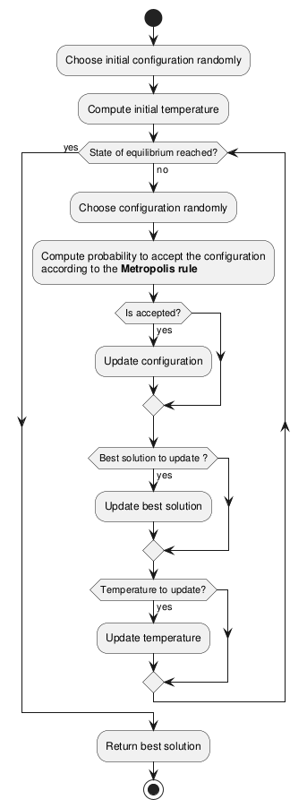
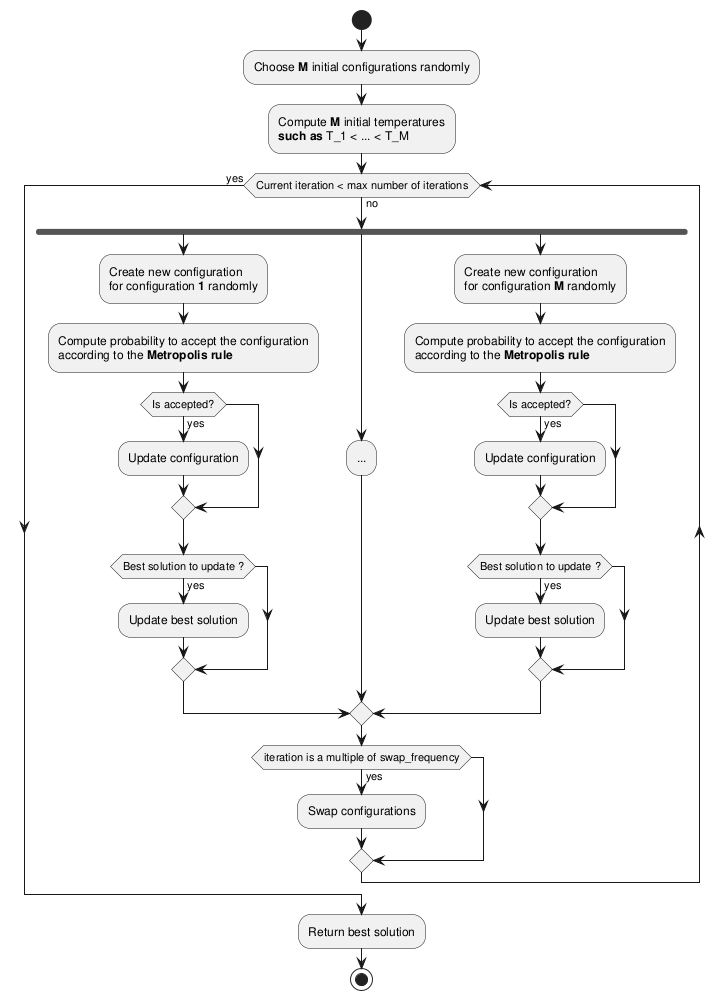

\newpage

# Introduction

(0.25)

be specific on

- search space
- neighborhood
- fitness
- TSP
- greedy
- SA


Human have been always interested in optimization problem to avoid a loss of energy or money or something else.
In our digital world, the optimization play an important role in most domains.
For instance, a travel compagny will try to maximise its customer base by proposing the customer to visit a maximum number of cities with minimal cost for him.
Depending on the optimization of this problem, the compagny will have more customers and will develop more than another compagny in the same domain.
To deal with theses optimization issues, heuristics and metaheuristics algorithm are created, using different approaches and modelizations of the real problem to propose an optimization.
For instance, in case of the travel compagny, the problem can be modelized by finding a route that minimizes costs and passes through all the cities before returning to the agency.
Each city then represents a node in a graph, and each city is connected to the others by an edge weighted by the price of travel between those two cities.
This modelization of the problem is called Traveling Salesman Problem (TSP) and is known to be a NP-hard (Nondeterministic Polynomial-time hard) problem, that means that we can't find a solution in polynomial time.
To find a solution that may not necessarily be optimal, we use heuristics and metaheuristics algorithm.

In this work, we will try to find a solution to the TSP problem by a metaheuristic method called Simulated Annealing method.

\newpage

# Methodology {#sec-met}

(1.5)

First, we will explain some terms and definitions used in the rest of this report.

## Modelization and definitions

The TSP problem can be modelized by $N$ cities to visit, numeroted from $0$ to $N - 1$, with a cost matrix $W$ that gives at the position $i, j$ the cost of the travel between city $i$ and city $j$.
Each city is connected to each others, so the graph is fully connected.
In this work, we assume that the cost of the travel between city $i$ and $j$ is the same in both directions.
So the cost matrix $W$ is symetric because $W_{ij} = W_{ji} \ \forall \ i, j \ \in \{0, \cdots , N - 1\}$, which implies that $W = W^T$.
Each solution can be written as a list of $N$ cities in the order of visit.
When the last city of the list is reached, the customers returns to the agency in the first city of the list.
For instance, for $N = 3$ cities, a solution can be $[3, 1, 2]$ that means the customer will first visit city $3$, then city $1$ and finaly city $2$ and then return to agency in city $3$.

### Search space {#sec-search}

The search space gives the set of all possibles solutions for a given problem.
In specific case of TSP problem, the search space will be the set of all the cyclic paths that go through all the cities.

As the paths are cyclic, it means that for instance path $[1, 2, 3]$ is the same that $[3, 1, 2]$.
For $N$ cities, for a given path, it's possible to perform $N$ cyclic rotations before returning on the given path.

As we have assumed that the cost between city $i$ and $j$ is the same in both directions, it means that for instance path $[1, 2, 3]$ is the same that $[3, 2, 1]$.
So for $N$ cities, for a given path with its set of cyclic rotations, if we perform an inversion, we will obtain an inversed path with its corresponding set of cyclic rotations.

So a path with a given cost can have $2N$ variants.

So for $N$ cities, the search space will be of size $S$ given by the formula [-@eq-size].

$$
S = \frac{\text{Number of possible paths}}{\text{Number of variant per path}} = \frac{N!}{2N} = \frac{(N - 1)!}{2}
$$ {#eq-size}

So with a great $N$, the search space becomes astronomic.

Example: $N = 15 \ \Longrightarrow \ S = \frac{(15 - 1)!}{2} = 4.3 \times 10^{10}$

### Neighborhood

The neighborhood returns a set of solutions closest to the given solution by slightly modifying the given solution.
It depens on the modelization of the problem.
In our case, each solution is a list of cities in order of visit.

We define the neighborhood like a swap of 2 elements of the current solution that gives another solution.
The neighbor solution obtained must differs from the current solution and also from all cyclic rotations and inversions of the current solution.

So for a solution given with $N$ cities, the size of the neighborhood is borned by the number of unique permutations of 2 elements in a list, like the formula [-@eq-neimax] show us.
The born is the number of permutations of 2 elements in a list because all the permutations will not be taken since certain permutations can result in a cyclic or inverse rotation of the solution.

$$
\text{Number of neighbors} \ \leq \ \begin{pmatrix} N \\ 2 \end{pmatrix} = \frac{N!}{2!(N - 2)!} = \frac{N(N - 1)}{2}
$$ {#eq-neimax}

### Fitness

The fitness, or cost function, returns the total cost of the travel around all the cities, according to the weight matrix $W$.
As explained above, the cost between city $i$ and city $j$ is given by the element $i, j$ of the cost matrix $W$ which is symetric.

So we can define a fitness function as the sum of the cost of all travel between cities in a given solution $x$, as shown in the formula [-@eq-fitness].

$$
f(x) = W_{x_Nx_1} + \sum_{i = 2}^N W_{x_{i - 1}x_i}
$$ {#eq-fitness}

Note that the term $W_{x_Nx_1}$ in the formula [-@eq-fitness] design the cost of returning to the agency.

## Heuristic vs metaheuristic

### Heuristic

An heuristic approach to an optimization problem will try to find a good solution in polynomial time.
It's a deterministic approach, which means that with same input, the method will give always the same output: nothing is given to the hasard.
However, the heuristic approach is specific to each problem.
Due to its deterministic nature, the algorithm will tend to be blocked by local optimal solutions in case of complex problems.

For instance, an heuristic algorithm that find the minimum of a function will pretty work on simple function like squared functions.
However, for a complex function that admits a lot of local minimum, the heuristic algorithm will be blocked in a local minimum because for the algorithm, the minimum is found.

A greedy algorithm is a heuristic algorithm which make the best choice at each step.
In this way, we hope to reach the global optimum.

### Metaheuristic

A metaheuristic approach will try to find a good solution for a given problem by exploring the search space [-@sec-search] of the problem.
It's a stochastic approach, that means that probabilities are integrated to choice a solution for next step, that allow to don't take always the optimum solution.
The stopping criteria is not the found of a good solution, but it is defined by the user through the guided parameters.
The guided parameters are customisable by user and indicate in most case how, where and how long the metaheuristic algorithm will search.

Since the algorithm does not stop when it finds a solution and have some non-deterministic mechanism to choose next solution, theses prevent it from being blocked by a local solution, compared to heuristic algorithms.

So metaheuristic algorithms are good for complex problems.
However, for simple problems, heuristic algorithm are more efficient because they will not make a big exploration of the search space like a metaheuristic algorithm can make, especially if the guided parameters are not properly set.

Metaheuristic algorithms are relatively simple to implement and don't depend on given problem.
The challenge in metaheuristic algorithms result in the choice of guided parameters, which balance exploring the search space and exploiting the regions already visited.

### Comparison

The table [-@tbl-comparison] describe the differences between heuristic and metaheuristic algorithms.


| Feature              | Heuristic                                | Metaheuristic                                    |
|---------------------|-------------------------------------------|--------------------------------------------------|
| Method type         | deterministic                             | often stochastic                                 |
| Approach            | problem-based                          | general                                  |
| Implementation      | often simple                              | often simple                           |
| Speed               | fast                                      | slower                                           |
| Problem type        | well-defined, structured problems          | complex or poorly understood problems            |
| Stopping criteria   | fixed (e.g. solution found)               | user-defined (e.g. time, iterations, convergence)|
| Local optima        | often stuck                               | can escape                                       |
| Use case            | when problem structure is known            | when heuristics are ineffective                  |

: Comparison between heuristic and metaheuristic algorithms {#tbl-comparison}

In our case, we will try to implement both heuristic and metaheuristic algorithms: a greedy algorithm for heuristic and an algorithm that follows the simulated annealing method for metaheuristic.
Then, we will compare obtained results.

## Simulated Annealing

The simulated annealing is inspired on the physical annealing process in metallurgy.

### Physical inspiration

In metallurgy, to improve quality and capabilities of a metal, the metal is heated to high temperature and then cooled slowly.
This is based on the fact that every physical system tends toward a state of equilibrium where energy is minimal.
So when the metal is heated, the atoms of metal will have enough energy to move inside the metal.
Then, they will position themselves in such a way as to reduce energy consumption.
Their new positions will be more ordered than before heating the metal.
This will create a better structured metal, which will improve quality and capabilities of the metal, like making it less brittle, more flexible or something else.

### Algorithm principe

For the simulated annealing method in algorithmics, it will be the same process.

At the begining of the algorithm, the temperature will be very high, allowing a great exploration of the search space.
In fact, with a great temperature, the system will have enough energy to make big jumps accross the search space.

Then, the temperature will decrease, which will force the exploitation.
It's due to the fact that with a smaller temperature, the system is no longer able to achieve big jumps accross the search space.

Finaly, the algorithm will run until a state of equilibrium is reached, with a temperature more and more cold.
The state of equilibrium is in general user defined. In our case, the state of equilibrium is reached when no improvement of fitness is made during last 3 changes of temperature.

### Algorithm structure

The algorithm can be represented by the @fig-diagram in appendix [-@sec-appendix].

It basically works like this:

- initial configuration and temperature.
  In general, the initial configuration is choosen randomly.
  The temperature is a guided parameter.
  In our case, we take $100$ random configurations in the entire search space and compute the mean of the absolute value of the fitness difference $\Delta E$ of theses points with the initial configuration.
  Then, the initial temperature $T_0$ is defined such as $e^{\frac{-\langle \Delta E \rangle}{T_0}} = 0.5$ with $0.5$ the acceptance rate of a given configuration of the search space.
  The global search allows to give a global view of the variance of fitness inside the search space.

- Update configuration according to the metropolis rule given by the formula [-@eq-metropolis].
  $$
  P = \begin{cases}1 & \text{if} \ \Delta E < 0 \\ e^{\frac{-\Delta E}{T}} & \text{otherwise}\end{cases}
  $$ {#eq-metropolis}
  $\Delta E$ is the fitness difference between the new configuration and the current configuration.
  So the probability $P$ to choose the given element is always $1$ if this element gives an improvement to the current fitness, and is of $e^{\frac{-\Delta E}{T}}$ otherwise, as described in the formula [-@eq-metropolis].
  In other words, it means that if the new configuration is an improvement of the current configuration, it will be directly accepted.
  And if the new configuration is not an improvement of the current configuration, it means that the difference is positive and the new configuration
  will be accepted with a probability that decrease exponentialy as the difference grows, as shown on @fig-probability.^[For details about impact of temperature on the search, see section [-@sec-temp]]

```{python}
#| label: fig-probability
#| fig-cap: "Probability to choose configuration"
#| fig-pos: 'H'
#| echo: false
#| fig-width: 3
#| fig-height: 2.5
#| fig-align: center

import matplotlib.pyplot as plt
import numpy as np

x = np.linspace(-2, 2, 200)

def P(x: np.ndarray, T: float = 1) -> np.ndarray:
  y = np.ones_like(x)
  y[x >= 0] = np.exp(-x[x >= 0] / T)
  return y

plt.figure(figsize=(10, 7), dpi=150)
for t in [0.01, 0.1, 0.5, 1.]:
  plt.plot(x, P(x, t), label=f"T = {t}")
plt.xlabel("Fitness difference between new configuration and current configuration")
plt.ylabel("Probability to accept new configuration")
plt.legend()
plt.show()
```

- If an equilibrium state is reached, update temperature according to the temperature schedule (a guided parameter).
  In general, the temperature variation is defined as a geometric sequence, that is given in our case by: $T_{k + 1} = 0.9 \times T_k$.
  The equilibrium state is reached when enough configurations have been accepted of when enough configurations have been visited (configurations accepted + not accepted) with the given temperature.
  In our case, to reach equilibrium state, $12N$ configurations must be accepted or $100N$ configurations must be visited with $N$ the number of cities.
- Iterate until the halting condition is reached.
  The halting condition is in general given by no improvement of the fitness during last $X$ temperature changes (in our case, $X = 3$).
- Return the best configuration that gives the best fitness.

As it is easily possible to see, the method depends on a few guided parameters, like the initial temperature and the update of the temperature...
This represents a challenge to set them correctly, and the quality of the result depends on this guided parameters.
That's why the main difficulty of the simulated annealing method, like other metaheuristics methods, is, among other things, to correctly set the guided parameters.

#### Impact of the temperature {#sec-temp}

The temperature plays a crutial role in the simulated annealing method.
We speak about high and low temperature, but what is the impact of the temperature on the choice of the next configuration ?
To answer, we will see 2 cases.

1. *Low temperature*.
   When the temperature is low, as we can see on the @fig-probability, the probability to accept an element that is worse than the current configuration is very low,
   so we accept only configurations that are at least as good as the current configuration.
   The current configuration is therefore exploited since we try to find a better configuration around the given configuration.
2. *High temperature*.
   When the temperature is high, as the @fig-probability show us, the probability to accept worse configurations is high.
   So we try to explore further the search space to find better configuration by accepting more configurations.

### Algorithm variant: the Parallel Tempering (PT)

There exists different variants of the simulated annealing algorithm, such as parallel tempering.

This variant is based on the same principe, but works quite differently, with different guided parameters.
The parallel tempering algorithm can be represented by the diagram [-@fig-diagram2] in appendix [-@sec-appendix].

The principle is to explore space in several locations.
To achieve this goal, $M$ replicas of the simulated annealing method are made.
A list of $M$ temperature is set such as $T_1 > \cdots > T_M$.
This list describe the fixed temperature $T_i$ for the simulated annealing replica $i$.
A swap between adjacent replicas is made at a given frequency.

In more details, the parallel tempering works as follows:

- Initial configuration: $M$ random configurations are choosen. In general, $M = \sqrt{N}$.
- Initial temperature: a list of temperature is defined with $T_1 > T_2 > \cdots > T_M$.
- For each current configuration $i$, choose a new configuration according to the Metropolis rule [-@eq-metropolis] with $T_i$ as temperature.
- Each $n$ iterations, swap configurations according to the fitness of theses configurations.
  The swaps are only attempted between configurations with adjacent temperatures.
  So for instance, configuration $i$ cannot be swapped with configuration $j$ if there exists a configuration $k$ such as $T_i > T_k > T_j$.
  $\Delta_{ij}$ is then defined as $(fitness_i - fitness_j)(\frac{1}{T_i} - \frac{1}{T_j})$ with $i < j$.
  The Metropolis rule is then applied to $\Delta_{ij}$ to decide if the swap is accepted or not, as described in the formula [-@eq-metropolis2].
  $$
  P = \begin{cases}1 & \text{if} \ \Delta_{ij} < 0 \\ e^{-\Delta_{ij}} & \text{otherwise}\end{cases}
  $$ {#eq-metropolis2}
  In this way, as explained in section [-sec-temp], when we have a good configuration, we exploit it by decreasing the temperature,
  and when we have a bad configuration, we want to explore more the search space to find better configurations by increasing the temperature.
- Iterate until halting condition is reached. In our case, the halting condition is the number of iterations.

So this algorithm can be an improvement of the simulated annealing system depending on the problem, and a parallelization of the method, as its name suggests, is possible to achieve, allowing more exploration of the search space.
However, like for each metaheuristics, the guided parameters such as $M$, the list of temperatures $T_1 > \cdots > T_M$ and the maximum number of iterations must be properly defined to have a method that works quite well.

\newpage

# Implementation

(1)

The implementations of both simulated annealing and parallel tempering are based on the diagrams [-@fig-diagram] and [-@fig-diagram2], included in the appendix [-@sec-appendix].
However, some pseudo-code are provided in sections below.

## Pseudo-codes

We are looking for path that goes across $N$ cities.
The set of cities is given, and the cost of a travel between $2$ cities is given by distance between theses $2$ cities.

### Greedy

- initial step: choose randomly an initial city and put it in the path
- loop until each city is in the path:
  - compute distance between given city and the rest of the cities
  - choose city with smallest distance
  - add city to the path
- return the path

### Simulated annealing

- initial step:
  - choose randomly a path. If `enhanced_mode` is activate, choose a path according to an optimization method (combination of greedy and simulated annealing)
  - choose initial temperature:
    - compute average of fitness change $\langle | \Delta E | \rangle$ for $100$ random paths
    - take initial temperature $T_0$ such as $e^{-\frac{\langle | \Delta E | \rangle}{T_0}} = threshold$
      with $threshold$ the acceptance rate of a path in the search space.
- loop until no improvement of fitness is made during last 3 temperature changes
  - choose randomly a new path from current path (by swapping 2 cities)
  - compute probability of acceptance according to Metropolis rule [-@eq-metropolis]
  - if accepted
    - update path
    - if updated path is better than best path found so far
      - update best path
      - indicate that an improvement of fitness is made
  - if number of paths attempted is greater than $100N$ or number of paths accepted is greater than $12N$
    - update temperature according to `T_schedule` given: $T_{k + 1} = \text{T\_schedule} \times T_k$
- return best path with best fitness

### Parallel Tempering

The number of replicas of simulated annealing is given by $M$ that is generaly defined like this: $M = \sqrt{N}$

::: {.callout}

1. initial step

  choose randomly $M$ paths. If `enhanced_mode` is activate, choose $M$ paths according to an optimization method.

  choose initial temperature:

  - compute average of fitness change $\langle | \Delta E | \rangle$ for $100$ random paths
  - take initial temperature $T_0$ such as $e^{-\frac{\langle | \Delta E | \rangle}{T_0}} = threshold$
      with $threshold$ the acceptance rate of a path in the search space.
  - Get temperature list $T$ multiplying $T_0$ by a sequence of factors that follow a `linear`, `quadratic`, `exponential` or `logarithmic` progression.
    For instance, for linear progression, we have $T = T_0 > \frac{N - 1}{N}T_0 > \cdots > \frac{1}{N}T_0$

2. loop until max number of iterations is reached

  for each path in paths

  - choose randomly a new path (by swapping 2 cities)
  - compute probability of acceptance according to Metropolis rule [-@eq-metropolis]
  - if accepted
    - update path
    - if updated path is better than best path found so far
      - update best path

  each `swap_frequency` iteration

  - swap adjacent replicas according to their fitness and Metropolis rule [-@eq-metropolis2].
    For instance, if $fitness_1 < fitness_2$, swap replicas $1$ and $2$.

3. return best path with best fitness

:::

\newpage

# Results

(1)

- circle
- cities
- cities2
- 20
- 60
- 80
- 100

Temperature change execution time

Just show plots and results, not discussion...

\newpage

# Discussion

(2)

- greedy vs simulated annealing (SA)
- abrupt temperature change

- diversification
- intensification

\newpage

# Conclusion

(0.25)

\newpage

# Appendix {#sec-appendix}

{#fig-diagram width="50%" fig-pos='H'}

\newpage

{#fig-diagram2 width="100%" fig-pos='H'}
